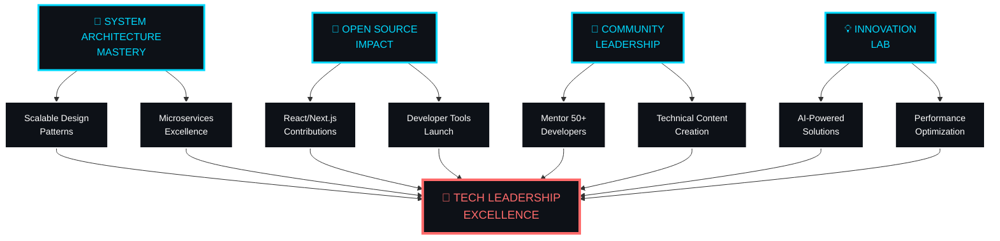

<div align="center">
  
</div>


<div align="center">
  
</div>


<div align="center">
  
</div>


## 🔥 **THE ARCHITECT BEHIND THE CODE**

```typescript
class Developer {
    name: string = "Sudip GC";
    role: string = "Full Stack Architect";
    location: string = "Nepalgunj, Nepal 🇳🇵";
    
    languages: string[] = ["C/C++", "JavaScript", "Python", "TypeScript"];
    specialties: string[] = ["System Design", "Performance Optimization", "Scalable Architecture"];
    
    currentMission(): string {
        return "Transforming ideas into powerful digital solutions";
    }
    
    lifePhilosophy(): string {
        return "Code is poetry written in logic 🎭";
    }
}

const sudip = new Developer();
console.log(sudip.currentMission()); // Building tomorrow's tech today
```

---

## 🛠️ ** Tech Stack**

<div align="center">

### 🚀 **Core Languages & Frameworks**


### 🛠️ **Development Ecosystem**


### 🔮 **Currently Mastering**


</div>


## 📊 **BATTLEFIELD STATISTICS**

<div align="center">
  
  
</div>

<div align="center">
  
</div>

<div align="center">
  
</div>

---

## 🏆 **GitHub Trophies**

<div align="center">
  
</div>

---

## 🎯 **CURRENT MISSION BRIEFING**

<div align="center">

### 🔥 **Active Sprint - Q2 2025 Strategic Focus**


</div>
## 🚀 **PROJECT SHOWCASE TERMINAL**

```bash
sudip@github:~$ ls -la ./legendary-projects/

drwxr-xr-x  7 sudip  staff   224 May 31 2025 .
drwxr-xr-x  3 sudip  staff    96 May 31 2025 ..

📁 DSA-USING-C/
   ├── 🔥 Pure algorithmic mastery in C
   ├── 📈 Performance optimization focus
   └── 🎯 Status: Battle-tested & Production Ready

📁 project-Euler/
   ├── 🧮 Mathematical programming artistry
   ├── 🔬 Complex problem-solving showcase
   └── 🎯 Status: Continuously Evolving

📁 ParyatanPlan/
   ├── 🌍 Tourism innovation platform
   ├── 🚀 Full-stack development prowess
   └── 🎯 Status: Recently Deployed

📁 InvitationWebsite/
   ├── 💌 Event management solution
   ├── 🎨 UI/UX design excellence
   └── 🎯 Status: Live & Functional

sudip@github:~$ echo "More epic projects loading..."
More epic projects loading...
```


---

## 🌐 **THE DEVELOPER'S PHILOSOPHY**

<div align="center">

```
     ┌─────────────────────────────────────────────────┐
     │                                                 │
     │    "In a world full of copy-paste developers,   │
     │     I choose to be the one who writes           │
     │     original solutions from scratch."           │
     │                                                 │
     │              ~ The Code Architect               │
     │                                                 │
     └─────────────────────────────────────────────────┘
```

</div>


## 🤝 Let's Connect!

<div align="center">

[](https://github.com/Sudip369369)
[](#)
[](#)
[](#)


### ⚡ **Real-time Stats**


</div>


<div align="center">
  
</div>


<div align="center">
  <strong>⭐ If you like my work, consider giving it a star or connecting with me! ⭐</strong>
</div>

</div>

<div align="center">
  
</div>
